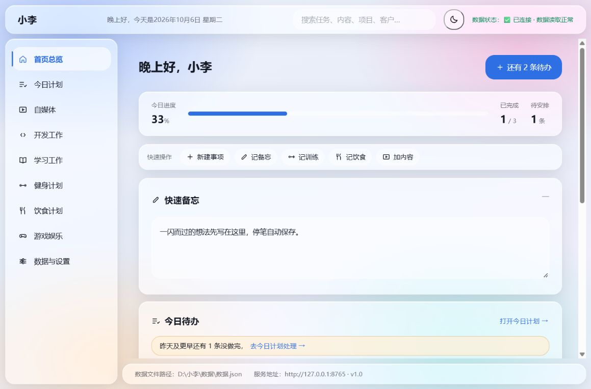
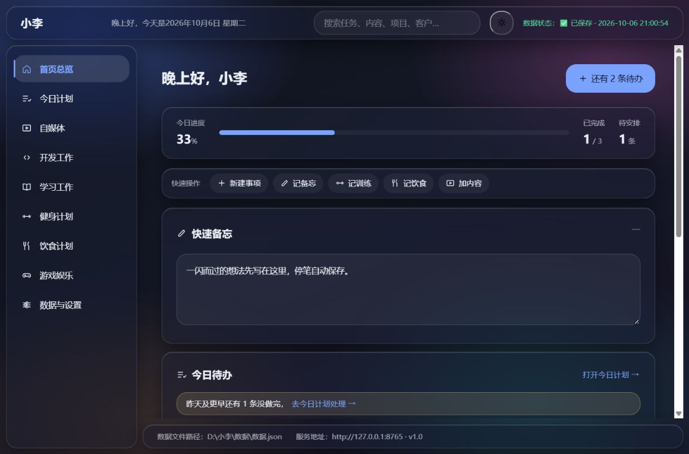

# 小李

> A local offline personal efficiency dashboard with macOS Liquid Glass UI.
> Run locally, store all data in JSON files, no database, no network requests.
> Contains schedule, media, development, fitness and diet modules.

只在你自己电脑上跑的个人工作台：**不登录、不联网、不上云、不装依赖**。
双击一个文件，浏览器打开十个模块，所有数据存成本机一个 JSON 文件。

## 它长这样





## 十个模块

| 模块 | 干什么 |
| --- | --- |
| 首页总览 | 简洁 / 完整双视图（默认简洁）：首屏今日进度 + 今日待办 + 财务摘要（含到期债务预警），高频模块摘要卡默认展示、次要模块折叠收起；完整模式一次看全部模块 |
| 今日计划 | 今天的任务；「昨天没做完的」一键挪到今天；**月历视图**看哪天有安排 |
| 自媒体 | 多平台账号（粉丝 / 本周涨粉 / 播放 / 待发布）+ 数据概览（汇总、近 30 天趋势、爆款 TOP3）+ 发布排期月历（平台筛选、拖拽排期）+ 想法 → 撰写中 → 剪辑中 → 待发布 → 已发布的流水，发布后录播放 / 点赞 / 单作品涨粉 |
| 开发工作 | 项目（卡片**可拖拽排序**、可按关键词/状态**筛选**）+ 每个项目的待办 / 问题 / 进展时间线 |
| 学习工作 | 学习对象（书/课程/视频/技能）+ 按天的学习记录，记时长和心得，标「待复习/已复习」 |
| 记账 | 记一笔支出/收入，月历上看每天花了多少（超支的日子标红），本月概览与总/分类预算，分类占比环形图，账户与余额；另有「债务欠款」子页（记录还款会自动生成一笔账目） |
| 健身计划 | 每周训练安排、按天打卡、体重记录（自动算和上次的差） |
| 饮食计划 | 三餐 + 加餐、喝水杯数，能翻回前几天补记 |
| 游戏娱乐 | 在玩 / 想玩 / 已通关 / 弃坑，记平台、时长和进度 |
| 数据与设置 | 导出、导入恢复、自动备份、**回收站**、外观与标语、清空数据 |

另外还有：顶部全局搜索、四套皮肤（液态玻璃 / 极简 / 笔记 / 粗野）× 明暗三态
（浅色 / 深色 / 跟随系统，跟着电脑自动变）、
软删除回收站、多窗口防覆盖、运行日志、一键自检。

## 怎么跑

需要电脑上有 **Python 3**（3.8 以上都行）。

**Windows**：双击 `启动.cmd`。黑窗口起来后浏览器会自动打开界面，
**关掉黑窗口就等于停止程序**。

**macOS / Linux**：在项目目录执行

```bash
python3 app/服务.py
```

它会起一个只监听 `127.0.0.1` 的小服务，然后手动打开它打印出来的地址。

## 看效果 / 演示

开发用的这一份可以一键塞一套样例数据（任务、学习记录、训练、体重、
自媒体……全都铺在当前这个月），用来演示、截图、看界面效果：

双击 `演示数据.cmd`，按数字选：**1** 载入示例数据（你现在这份会先存一份
快照，随时能还原）、**2** 还原回载入之前、**3** 只看现在有哪些数据、
**4** 载入到「现在正开着的那个小李」。

它默认只动**这份代码自己的** `数据\` 目录，不会碰你日常在用的那一份。
`同步到小李.cmd` 也不会把它（`演示数据.cmd` 和 `tools\`）带到日常那份去——
那套工具只服务开发版，免得哪天在日常那份里手一滑，把真实数据换成演示数据。
载入前的数据会存成 `备份\保留-演示前-*.json`（标着「长期保留」，自动清理
会跳过它），在「数据与设置 → 导入恢复」里也能选它还原。

另外：仓库和日常那份可以同时开着。启动时会先看端口上那个是不是「自己
这一份」，不是就往后找一个空端口（8766、8767……），绝不会把浏览器指到
另一份的旧界面上——这样你在开发版里改的东西一定能看见。

## 数据在哪

全部数据就是**一个文件**：`数据/数据.json`（第一次运行时自动创建）。
旁边还有两个目录：

```
数据/
  数据.json         全部数据就这一个文件，随时可以复制走
  备份/             每天首次打开自动存一份，保留最近若干份
    _最近一次.json   每次保存前的上一版
  导出/             手动导出的备份文件
  日志/运行.log     启动、备份、导入这些关键事件的流水
```

想换地方放数据（比如另一块盘），设一个环境变量就行：

```bash
XIAOLI_DATA_DIR=D:\我的小李数据 python app/服务.py
```

## 怎么更新

如果「日常用的那份」和「开发用的这份」是分开的两个目录，
把代码同步过去就行——仓库里的 `同步到小李.cmd` 就是干这个的（不会动你的数据）。

## 自检

双击 `自检.cmd`（或在终端跑 `python tests/自检.py`）。它会在一个**临时目录**里
自己起一个服务，把 28 项关键检查过一遍——接口、修订号、来源校验、备份、
长期保留、导出导入往返、清空快照、运行日志、零外链。**不会碰你正在用的数据。**

## 目录结构

```
启动.cmd              双击它开始用
自检.cmd              双击它做一次体检
同步到小李.cmd         把代码同步到日常用的那份
演示数据.cmd           给开发这一份塞一套样例数据（演示 / 截图用）
app/
  服务.py             本机小服务，只用 Python 标准库
  web/                界面：原生 HTML + CSS + JS，零框架零外链
    index.html
    app.js            外壳：顶栏 / 侧栏 / 状态栏 / 路由
    store.js          数据层：整份读、整份写、回收站、多窗口同步
    日历 calendar.js  全站共用的「挑日期」零件
    dialog.js         自绘确认框与轻提示
    icons.js          手写的内联 SVG 图标（不联网、不装图标库）
    modules.js        十个模块的唯一清单
    lib/              唯一一个第三方文件：SortableJS（拖拽排序用），本地放着
    money.js          金额换算与格式化（分 ↔ 元，纯函数）
    finance-calc.js   记账的纯计算：月度/按天/分类汇总、预算档位、超支日
    debt-calc.js      债务的纯计算：剩余、到期状态、合计、近 N 天到期
    media-calc.js     自媒体的纯计算：粉丝（快照+作品涨粉）、爆款、活跃度、趋势
    finance-shared.js 记账与债务共用的小工具（账户下拉、分类图标…）
    home / plan / media / dev / study / finance / fitness / diet / game / settings.js
    style.css         设计规范 + 四套皮肤，全在一个文件里
tests/自检.py         自检脚本（纯 Python，一键体检）
tests/自媒体计算.test.mjs 自媒体纯逻辑的单元测试（node tests\自媒体计算.test.mjs）
tests/记账计算.test.mjs 记账纯逻辑的单元测试（用 Node 跑：node tests\记账计算.test.mjs）
tests/债务计算.test.mjs 债务纯逻辑的单元测试（同样用 Node 跑）
tools/演示数据.py      上面那个「演示数据」的本体
docs/                 需求清单、设计文档、截图
```

## 几条设计上的选择

- **一个 JSON 文件，不装数据库**：个人数据量小，一个文件最好备份、最好搬走。
- **只用 Python 标准库**：不用 pip 装任何东西，`python app/服务.py` 就能跑。
- **前端不引框架**：不引 CDN、不引在线字体和图标，断网完全正常。
  唯一一个第三方文件是**本地放着**的
  [SortableJS](https://github.com/SortableJS/Sortable) 1.15.7（MIT，44KB），
  用来做开发工作页的项目卡片拖拽排序；没有它也能正常用，只是卡片拖不动。
  它的许可证随文件一起放在 `app/web/lib/sortable.LICENSE`。
- **写接口只认本机页面**：别的网站在浏览器里也能往 `127.0.0.1` 发请求，
  所以写接口会看来源，不是本机页面的一律拒掉。
- **删除先进回收站**：手滑删了能捞回来。
- **输入就自动保存**：单值字段（备忘、三餐、每周安排、标语…）停笔即存；
  行内编辑边打字边静默保存，点「取消」会退回编辑前的样子；
  表单填了一半没提交，关窗口前浏览器会拦一下。
- **筛选只影响显示**：开发工作页的关键词/状态筛选不会动数据，
  被筛掉的项目在拖拽排序时也保持原位。
- **两个窗口不会互相覆盖**：数据里带修订号，对不上就拒收；窗口之间用浏览器自带的
  `BroadcastChannel` 互相知会。

## 许可

[MIT](LICENSE)
